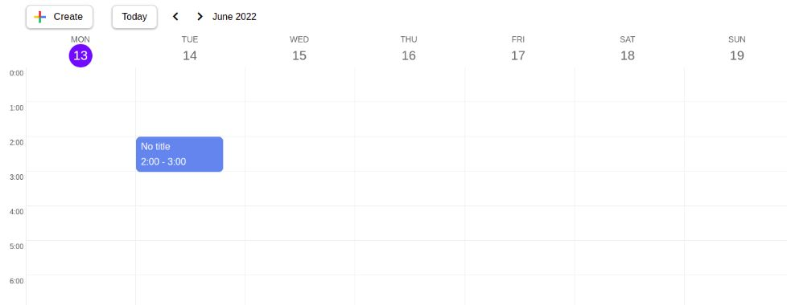

# calendar-react

### [Site link](https://naughty-swanson-dd52b8.netlify.app/)

<kbd>
  
</kbd>

 ### 🛠 The tech stack is:
- [React](https://reactjs.org/)
- [React-hook-form](https://react-hook-form.com/)
- [React-transition-group](https://reactcommunity.org/react-transition-group/)
- [HTML5](https://en.wikipedia.org/wiki/HTML5)
- [CSS3](https://en.wikipedia.org/wiki/Cascading_Style_Sheets)
- [Flexbox](https://en.wikipedia.org/wiki/CSS_Flexible_Box_Layout)
- [Sass (Scss)](https://sass-lang.com/)
- [BEM methodology](https://en.bem.info/methodology/)
- [Webpack](https://webpack.js.org/)
- [PropTypes](https://ru.reactjs.org/docs/typechecking-with-proptypes.html)

### Author

- Sen Serafim
